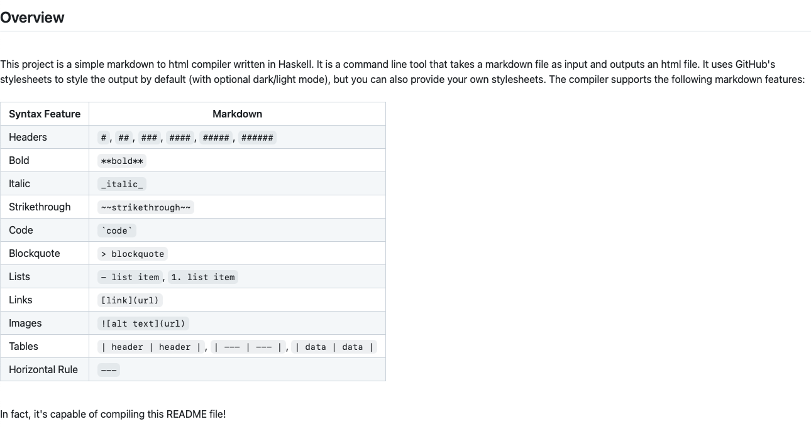

# markdown-to-html

A markdown to html compiler written in Haskell.


## Overview

This project is a simple markdown to html compiler written in Haskell. It is a command line tool that takes a markdown file as input and outputs an html file. It uses GitHub's stylesheets to style the output by default (with optional dark/light mode), but you can also provide your own stylesheets. The compiler supports the following markdown features:

|Syntax Feature|Markdown|
|---|---|
|Headers|`#`, `##`, `###`, `####`, `#####`, `######`|
|Bold|`**bold**`|
|Italic|`_italic_`|
|Strikethrough|`~~strikethrough~~`|
|Code|`` `code` ``|
|Blockquote|`> blockquote`|
|Lists|`- list item`, `1. list item`|
|Links|`[link](url)`|
|Images|``|
|Tables|`\| header \| header \|`, `\| --- \| --- \|`, `\| data \| data \|`|
|Horizontal Rule|`---`|

In fact, it's capable of compiling this README file!

> 

I wrote this project to learn more about Haskell and to get more familiar with pure functional programming. I've never written a compiler in a pure functional language before, so this was a fun project to work on.


## Implementation

The compiler is implemented using the `parsec` library for parsing the markdown file. The parser is a simple recursive descent parser that converts the markdown file into an abstract syntax tree (AST). Next, the Markdown AST is converted into an HTML AST. Finally, the HTML AST is converted into a string representation of the HTML file.

For command line argument parsing, the compiler uses the `optparse-applicative` library. The compiler can be run with the following command line arguments:

```bash
Usage: markdown-to-html-exe INPUT [-o|--output OUTPUT] 
                            [-s|--stylesheet STYLESHEET] [-v|--verbose] 
                            [-d|--dark]
```

## Building And Usage

To build the project, run the following command:

```bash
$ # Build the project
$ stack build
$ # Copy the executable to the root directory
$ cp $(stack path --local-install-root)/bin/markdown-to-html-exe markdown-to-html
```

This will use the `stack` build tool to download and compile the project's dependencies and build the project. Once the project is built, you can run the compiler on a given markdown file with the following command:

```bash
$ # Run the compiler
$ ./markdown-to-html README.md -o README.html
$ # (Run with dark mode)
$ ./markdown-to-html README.md -o README-dark.html -d
```

The commands above will compile the `README.md` file into an `README.html` file. The `-o` flag specifies the output file, and the `-d` flag specifies dark mode. You can also provide your own stylesheet with the `-s` flag.

## License

This project is licensed under the MIT License. See the [LICENSE](./LICENSE) file for more information.
